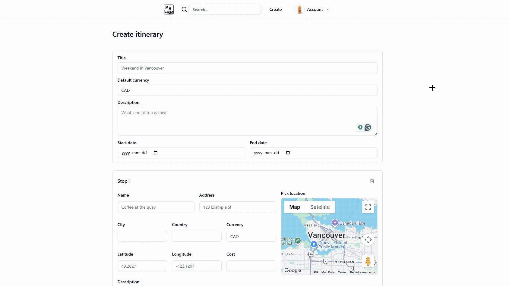

# Travioli

[English](README.md) | 日本語

## デモ

## 技術スタック

### コア技術

### 関連技術
- **フロントエンド**: Google Maps API, TanStack Query, React Router, Tailwind, shadcn
- **バックエンド**: OpenAPI, Zod, JWT認証, Nodemailer
- **インフラ**: Docker, GitHub Actions（CI/CD）
- **テスト**: Vitest, Supertest

## APIドキュメント
- OpenAPI仕様書はこちら: [openapi-docs.yml](./backend/public/openapi-docs.yml)

## テスト
- **Vitest** と **Supertest** を使用したバックエンドの単体テストおよび統合テスト
- [テストコード](./backend/src/__tests__/)

## 今後の改善予定
- AWSへのデプロイ
  - アプリケーションホスティング用の EC2 または ECS
  - PostgreSQL 用の RDS
  - Redis 用の ElastiCache
  - モニタリングおよびログ管理の構築
- Playwright を用いた E2E テストの追加